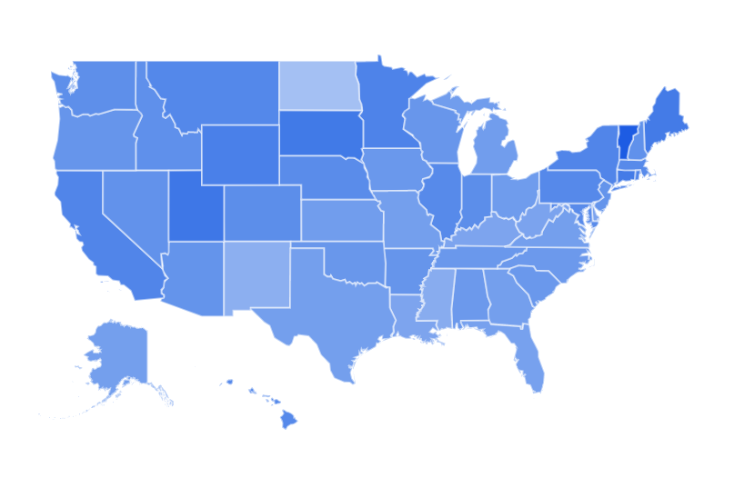

# Links

## EEOC

- https://www.eeoc.gov/eeoc/statistics/enforcement/sexual_harassment_eeoc_only_by_state.cfm
- https://www1.eeoc.gov/eeoc/statistics/enforcement/state_17.cfm
- https://www.eeoc.gov/eeoc/statistics/enforcement/index.cfm
- Availability of baseline employment tabulations by occupation groups: https://www2.census.gov/programs-surveys/demo/guidance/eeo/20121128-eeo-webinar-slides.pdf
- More current data: https://lehd.ces.census.gov/data/#qwi

## Others
-  https://trends.google.com/trends/explore?date=today%205-y&geo=US&q=%23MeToo

-  https://www.theguardian.com/media/2018/jun/10/cost-of-government-rises-when-local-newspaper-closes-study-finds
-  http://econprediction.eecs.umich.edu/

## Other sources of MeToo tweets

Mostly not-geotagged, but potentially useful for external validity corpus comparison

- https://data.world/from81/390k-metoo-tweets-cleaned (not geotagged)
- https://data.world/rdeeds/350k-metoo-tweets (not geotagged)
- https://data.world/dear/metoo (both geotagged and not)
