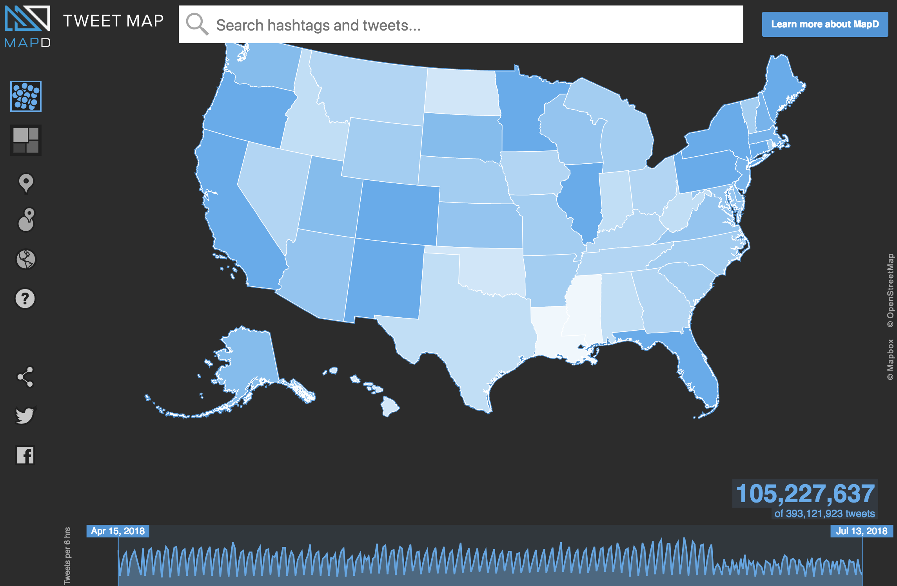

# Notes 2018-07-13

## Pricing:

https://sifter.texifter.com/

$7.50/10000 + $25/calendar day

## Links shared during talk

https://techcrunch.com/2018/02/01/twitter-is-opening-up-its-full-archive-to-the-broader-developer-community/

https://developer.twitter.com/en/docs/tutorials/choosing-historical-api.html

# After the meeting
## LV
### Geo distribution of tweets
- http://bit.ly/2LdESCF



### Costs of extract

- before it hit the roof:

```
Rule Text: #metoo followers_count:1..1000
Start Date: 01/01/2017
End Date: 01/31/2017
Estimated Activities: 800

The total cost of accepting this job is $782.50.
```

- after it hit the roof
```
Rule Text: #metoo followers_count:1..1000
Start Date: 11/01/2017
End Date: 11/30/2017
Estimated Activities: 624,000

The total cost of accepting this job is $1222.50.
```

- hi-follower after
```
Rule Text: #metoo followers_count:1000..10000
Start Date: 11/01/2017
End Date: 11/30/2017
Estimated Activities: 275,000

The total cost of accepting this job is $960.00.
```
